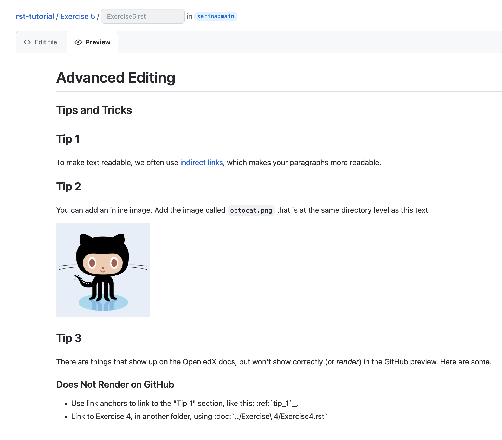

Exercise 5
##########

Your task is to match this output (note! the horizontal line is drawn by GitHub as part of the header. You do not need to explicitly draw it):

Tip
***

To scale an image, you can add a ``:width:`` or ``:height:`` directive to cap
the width or height of an image to a certain number of pixels.

Completing the Exercise
***********************

Complete the exercise by clicking on `Exercise5.rst <https://github.com/sarina/rst-tutorial/blob/main/Exercise%205/Exercise5.rst>`_,
clicking the pencil icon to edit, then editing the text with your own RST.
Use the Preview tab to check out how you're doing; you can click back to
"Edit File" as many times as you want to adjust your text.

When you're done, check out `answer.rst <https://github.com/sarina/rst-tutorial/blob/main/Exercise%205/answer.rst>`_
to see how we solved this problem. Click the ``Raw`` button to see how
we wrote the RST.
